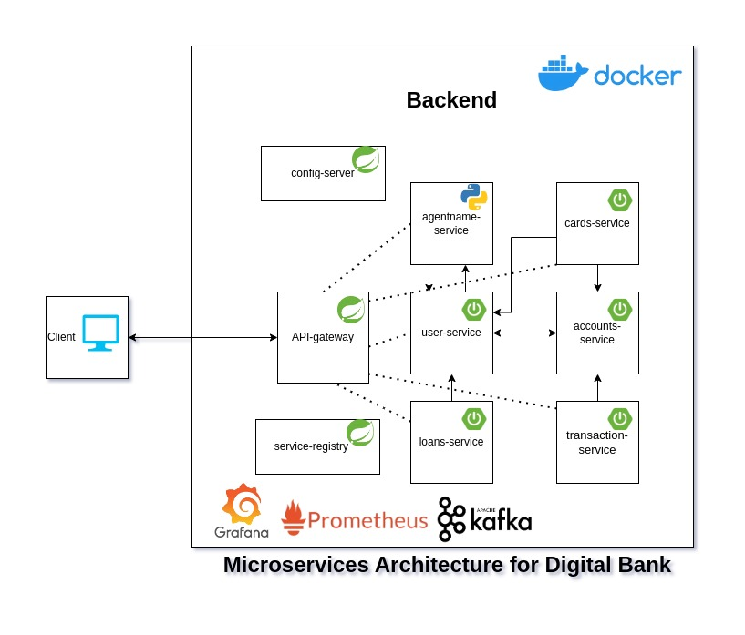

# Digital Bank Microservices

Welcome to the Digital Bank microservices project! This project is designed to create a scalable digital banking application using a microservices architecture. It consists of various services, including user management, accounts, loans, cards, transactions, and an agent name generator.

## Project Structure
<!-- Image of overall backend design -->


### Services

1. **User Service**
   - Manages user profiles and authentication.
   - Provides endpoints to create, update, and retrieve user information.

2. **Accounts Service**
   - Handles user accounts.
   - Manages account creation, balance inquiries, and transactions.

3. **Loan Service**
   - Manages loan applications and approvals.
   - Provides functionality to calculate EMI and manage loan statuses.

4. **Cards Service**
   - Manages debit and credit cards.
   - Allows users to request, activate, and manage their cards.

5. **Transactions Service**
   - Handles financial transactions between accounts.
   - Supports transaction history and balance updates.

### Supporting Components

1. **Spring Boot Service Registry**
   - A service registry for discovering and managing microservices.
   - Uses Eureka for service registration and discovery.

2. **Config Server**
   - Centralized configuration management for all microservices.
   - Stores and provides configuration properties for the services.

3. **Agent Name Generator (FastAPI)**
   - A FastAPI service that generates unique names for users.
   - Utilizes a JSON file with adjectives and nouns to create distinctive agent names.

## Getting Started

### Prerequisites

- Docker
- Docker Compose

### Setup

1. **Clone the Repository**

   ```bash
   git clone https://github.com/your-repository/digital-bank.git
   cd digital-bank
   ```

2. **Build and Start Services**

   Use Docker Compose to build and start the services.

   ```bash
   docker-compose up --build <service-name>/docker-compose.yml
   ```

3. **Addition of .env**
   
      Create a `.env` file in all the services and add the following environment variables:
   
      ```bash
      # .env file
      # Database credentials
      POSTGRES_DB=postgres
      POSTGRES_USER=postgres
      POSTGRES_PASSWORD=postgres

      # Ports
      SERVICE_REGISTRY_PORT=8761
      CONFIG_SERVER_PORT=8088
      ACCOUNTS_SERVICE_PORT=8082
      Loan_SERVICE_PORT=8083
      CARDS_SERVICE_PORT=8084
      TRANSACTIONS_SERVICE_PORT=8085
      USER_SERVICE_PORT=8081
      AGENT_NAME_GENERATOR_PORT=8086
      DB_PORT=5432
      PROFILE=prod

      JWT_SECRET_KEY=your-string-jwt-secret-key-here
      # Spring boot
      SPRING_PROFILES_ACTIVE: prod
      ```


4. **Access Services**
   Access the ports of the services using the following URLs:
    - **API Gateway:** `http://localhost:8080`
   - **User Service:** `http://localhost:8081`
   - **Accounts Service:** `http://localhost:8082`
   - **Loan Service:** `http://localhost:8083`
   - **Cards Service:** `http://localhost:8084`
   - **Transactions Service:** `http://localhost:8085`
   - **Agent Name Generator:** `http://localhost:8086`

### Configuration

- Configuration files are stored in the Config Server.
- Modify the configurations as needed in the `config` directory.


## Contributing

1. Fork the repository.
2. Create a new branch for your feature or fix.
3. Commit your changes.
4. Push to the branch.
5. Create a pull request.

## License

This project is licensed under the [MIT License](LICENSE).
