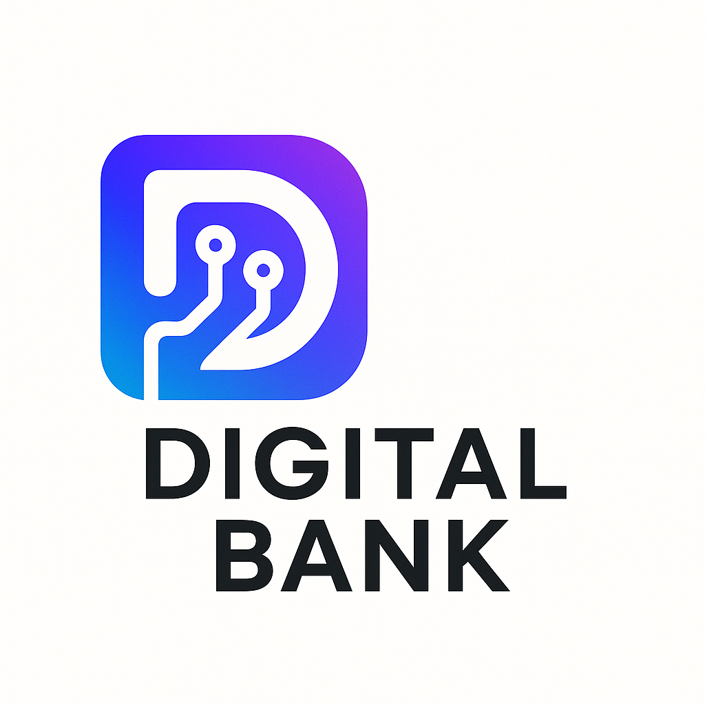
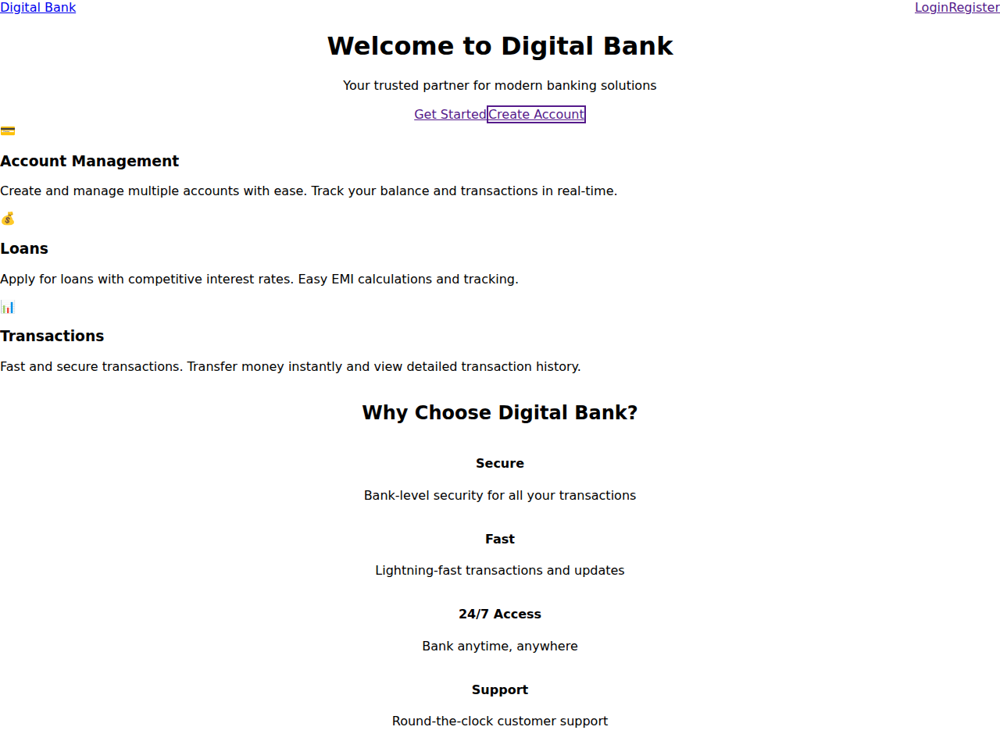
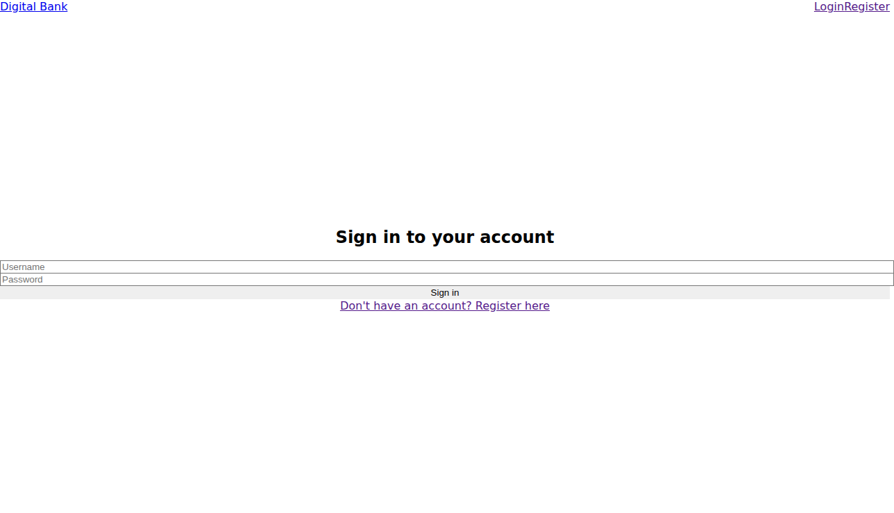
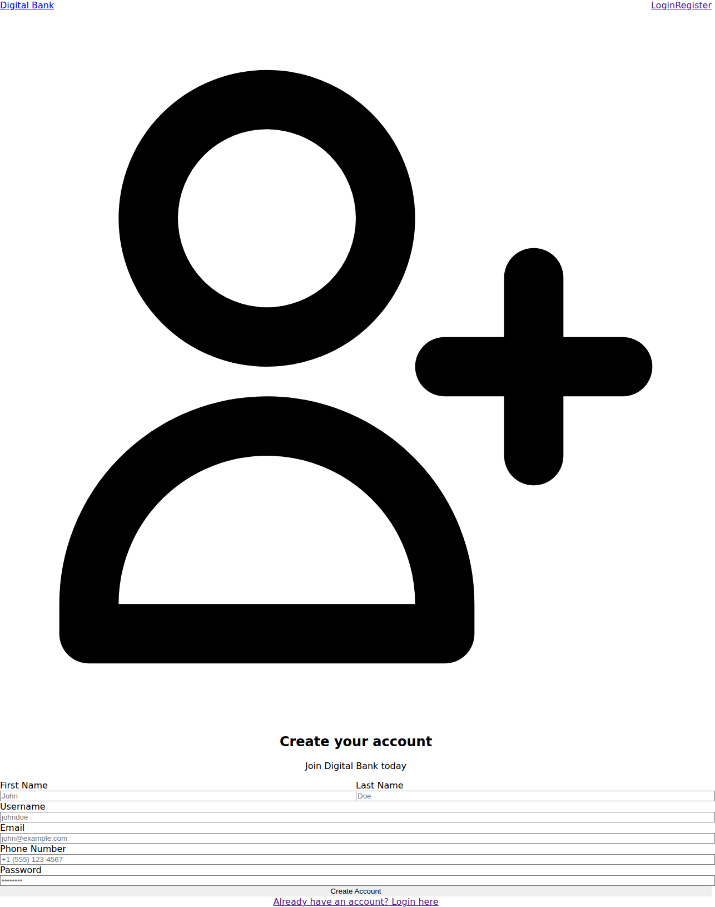
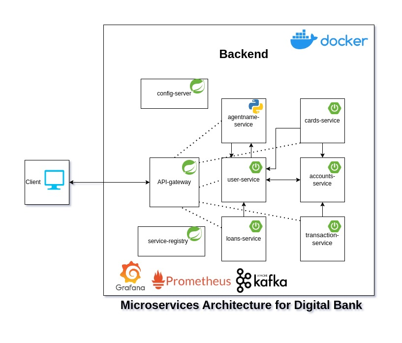

# Digital Bank



Welcome to the Digital Bank project! This application is designed to provide a scalable digital banking platform with core features such as user management, accounts, loans, cards, transactions, and an agent name generator.

## 📸 Application Screenshots

### Home Page


### Login Page


### Register Page


## Project Structure

The project consists of:
- **Backend**: Microservices-based architecture using Spring Boot
  - User Service
  - Account Service
  - Loan Service
  - Transaction Service
  - API Gateway
- **Frontend**: Modern React application with Tailwind CSS
  - Built with Vite for fast development
  - Styled with Tailwind CSS v4 for modern UI/UX
  - Responsive design for mobile, tablet, and desktop
  - Component-based architecture for reusability

<!-- Image of overall backend design -->

<!--  -->

### Features

1. **User Management**

   * Manage user profiles and authentication.
   * Endpoints to create, update, and retrieve user information.

2. **Accounts**

   * Handle account creation and balance inquiries.
   * Support for transactions between user accounts.

3. **Loans**

   * Submit and manage loan applications.
   * EMI calculation and loan status tracking.

4. **Cards**

   * Request and manage debit and credit cards.
   * Activate and monitor card usage.

5. **Transactions**

   * Perform and record financial transactions.
   * View transaction history and balances.

6. **Agent Name Generator**

   * A FastAPI-based feature to generate unique user names.
   * Combines adjectives and nouns from a JSON file.

7. **Frontend**

   * Modern React-based web application with Vite
   * User authentication and registration with JWT
   * Account management interface with real-time balance tracking
   * Loan application and EMI tracking system
   * Transaction history with advanced filtering
   * **Modern UI/UX Design**:
     - Gradient backgrounds and card designs
     - Smooth animations and transitions
     - Responsive layouts for all screen sizes
     - Interactive hover effects and micro-interactions
     - Loading states with animated spinners
     - Icon-enhanced interfaces
     - Modal dialogs with backdrop blur
     - Color-coded status badges
     - Professional form layouts with validation
   * **Styling with Tailwind CSS v4**:
     - Utility-first CSS framework
     - Custom color schemes and gradients
     - Responsive design breakpoints
     - Dark-themed components with shadows
     - Accessible color contrasts

## 🚀 Quick Start

Get started with Digital Bank in minutes!

### Option 1: Automated Setup (Recommended)

```bash
# Clone the repository
git clone https://github.com/Lokie-codes/digital-bank-v1.git
cd digital-bank-v1

# Run the setup script
chmod +x setup.sh
./setup.sh

# Start the backend
cd backend
docker-compose up --build

# In a new terminal, start the frontend
cd frontend
npm install
npm run dev
```

Visit **http://localhost:5173** to see the application!

### Option 2: Manual Setup

See the detailed [SETUP.md](SETUP.md) guide for manual installation and configuration.

## 📋 Prerequisites

* Docker (version 20.10+)
* Docker Compose (version 2.0+)
* Node.js 18+ (for frontend development)
* npm or yarn

## 🌐 Accessing the Application

* **Frontend (Development):** http://localhost:5173
* **Frontend (Production):** http://localhost:3000
* **Backend API Gateway:** http://localhost:8080
* **Service Registry (Eureka):** http://localhost:8761

### Local Development (Frontend Only)

To run the frontend in development mode with hot-reload:

1. **Navigate to the frontend directory**

   ```bash
   cd frontend
   ```

2. **Install dependencies**

   ```bash
   npm install
   ```

3. **Create environment file**

   Copy `.env.example` to `.env` and configure the API URL:

   ```bash
   cp .env.example .env
   ```

   The `.env` file should contain:
   ```
   VITE_API_BASE_URL=http://localhost:8080
   ```

4. **Start the development server**

   ```bash
   npm run dev
   ```

   The frontend will be available at `http://localhost:5173` with hot-reload enabled.

5. **Build for production**

   ```bash
   npm run build
   ```

   The optimized production files will be in the `dist/` directory.

## 🔧 Troubleshooting

Common issues and their solutions:

### Docker Network Error

If you see `network microservices declared as external, but could not be found`:

```bash
docker network create microservices
```

### Port Already in Use

If port 8080 or 5173 is already in use:

```bash
# Find and kill the process using the port (Linux/Mac)
lsof -i :8080
kill -9 <PID>

# Or change the port in the respective configuration file
```

### Services Not Starting

Check the logs to diagnose issues:

```bash
cd backend
docker-compose logs -f <service-name>
```

For more detailed troubleshooting, see [SETUP.md](SETUP.md#troubleshooting).

### Styling and Design

The frontend uses **Tailwind CSS v4** for a modern, responsive design:

- **Color Scheme**: Blue and indigo gradients with professional gray tones
- **Typography**: System fonts for optimal readability
- **Components**: Consistent card-based layouts with shadows and borders
- **Animations**: Smooth transitions and hover effects for better UX
- **Responsive**: Mobile-first approach with breakpoints for all devices
- **Icons**: SVG icons integrated throughout the interface
- **Forms**: Enhanced input fields with focus states and validation
- **Tables**: Styled data tables with alternating row colors
- **Modals**: Backdrop blur effects for better focus
- **Status Indicators**: Color-coded badges for different states

### Configuration

* Configuration settings are managed in a centralized location.
* You can update application settings in the `config` directory.

## ⚡ Performance Optimizations

### Frontend Optimizations

1. **Production Build**
   - Code splitting and lazy loading
   - Minification and tree-shaking
   - Optimized assets with Vite

2. **Caching Strategy**
   - Browser caching for static assets
   - Service worker for offline support (future enhancement)

3. **Image Optimization**
   - Use WebP format where possible
   - Lazy load images below the fold

### Backend Optimizations

1. **Database Connection Pooling**
   ```yaml
   spring:
     datasource:
       hikari:
         maximum-pool-size: 10
         minimum-idle: 5
   ```

2. **JVM Tuning**
   ```
   JAVA_OPTS: -Xms512m -Xmx1024m -XX:+UseG1GC
   ```

3. **Enable Response Compression**
   ```yaml
   server:
     compression:
       enabled: true
   ```

### Docker Optimizations

1. **Use BuildKit**
   ```bash
   export DOCKER_BUILDKIT=1
   docker-compose up --build
   ```

2. **Multi-stage Builds**
   - Already implemented in Dockerfiles
   - Reduces image size significantly

3. **Resource Limits**
   ```yaml
   deploy:
     resources:
       limits:
         cpus: '1'
         memory: 1G
   ```

For detailed optimization guides, see [SETUP.md](SETUP.md#optimizations).

## Contributing

1. Fork the repository.
2. Create a new branch for your feature or bug fix.
3. Commit and push your changes.
4. Open a pull request with a detailed description.

## 📚 Additional Documentation

- **[Setup Guide](SETUP.md)** - Detailed installation and configuration instructions
- **[Troubleshooting Guide](SETUP.md#troubleshooting)** - Common issues and solutions
- **[Optimization Guide](SETUP.md#optimizations)** - Performance tuning recommendations

## 🐛 Known Issues

1. **Docker Network** - Requires manual creation of 'microservices' network (fixed by setup script)
2. **Service Discovery** - Services may take 30-60 seconds to register with Eureka on first startup

## 📝 Changelog

### Latest Updates
- ✅ Added comprehensive application screenshots
- ✅ Created automated setup script
- ✅ Enhanced documentation with troubleshooting guide
- ✅ Added performance optimization recommendations
- ✅ Fixed Docker network configuration issue

## License

This project is licensed under the [MIT License](LICENSE).
